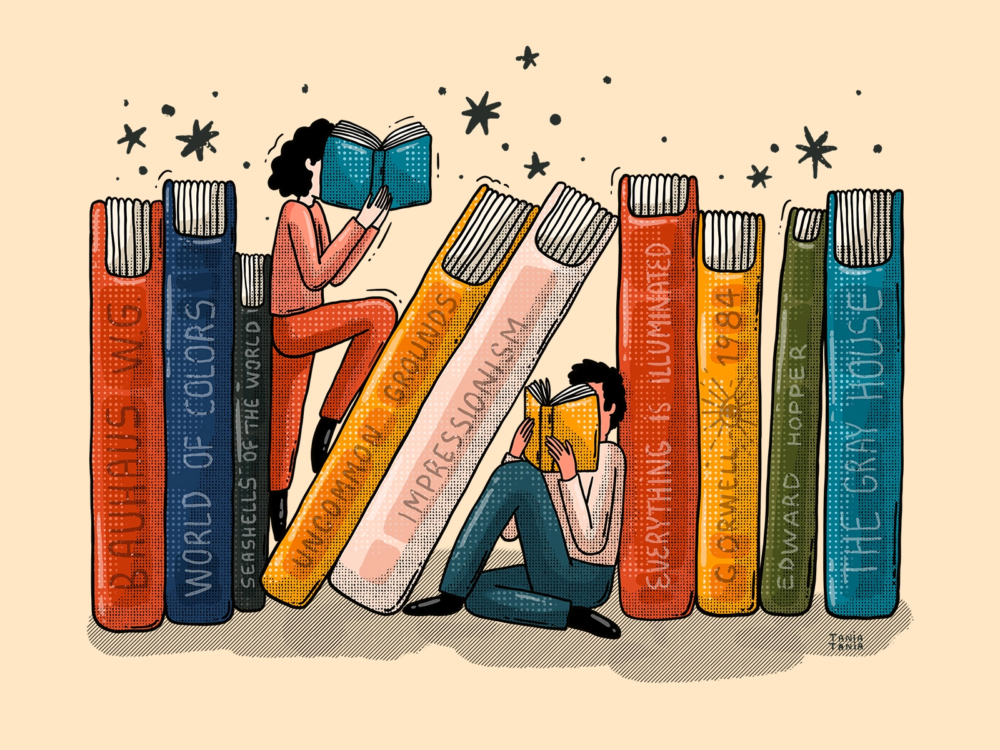

why read on different topics ? - to enhance your worldview, an understanding of the world, refer Meditations by Marcus Aurelius, Range by David Epstein

A central theme to Meditations is the importance of analyzing one's judgment of self and others and developing a cosmic perspective:

>       You have the power to strip away many superfluous 
>       troubles located wholly in your judgment, 
>       and to possess a large room for yourself embracing in 
>       thought the whole cosmos, to consider everlasting time, 
>       to think of the rapid change in the parts of each thing, 
>       of how short it is from birth until dissolution, 
>       and how the void before birth and that after dissolution 
>       are equally infinite. 

<!-- Oh, and here's a great quote from this Wikipedia on
[some funky link](https://en.wikipedia.org/wiki/Salted_duck_egg). -->

absorb knowledge from anyhwere you can get - but understand the context in which it could be applied in your situation - do not copy paste - something that worked for another person might not necessarily work you

how to read more books ? - refer mark manson's vid, or do youtube search
