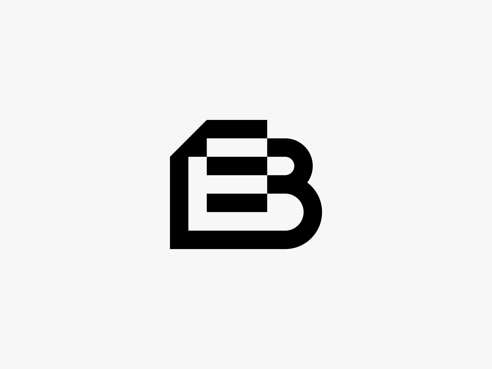

# Creating an E-book with Metalsmith

binary will be available soon, check [thedailyblink](https://github.com/NileshEvrywhr/thedailyblink) for source

-----------------------

Metalsmith is the framework I've used to create ebooks you'll find here. 

Have you ever tried making an e-book from markdown? When I searched online pandoc came up a lot but it didn't fit my use case. individual chapters, custom fonts, layouts, plus I wanted more control over the output. 

How did I come to learn to learn of it? Last year while I researching for static site builders for creating my personal website, Metalmith's name frequented due to it's short codebase. But I couldn't find any tutorials for quickly building a prototype. On their website they showcase a variety of usecases for Metalsmith plugin base approach since it's essentialy a file transformation tool, at least that's what I've come to understand. 

